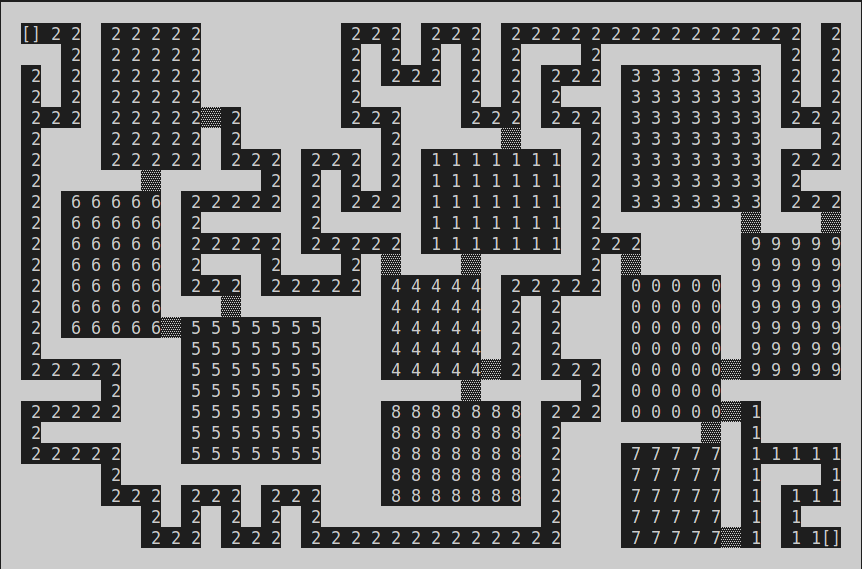
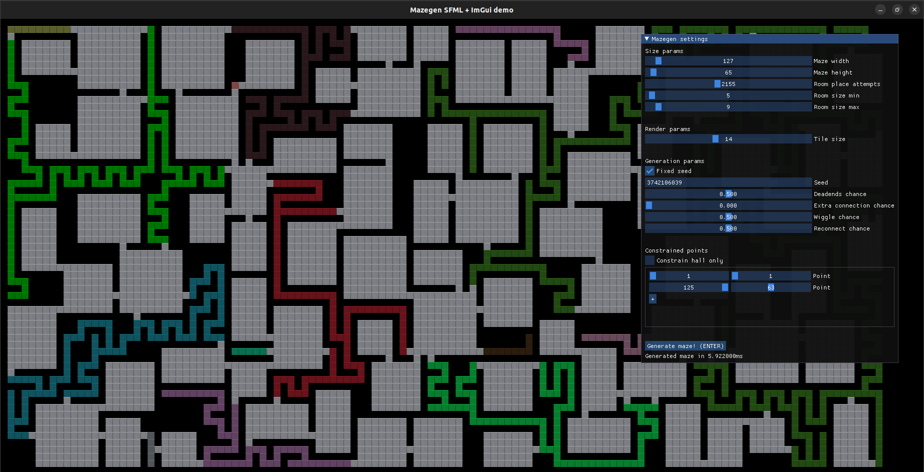

# Mazegen - a header-only maze generation library

Mazegen is a maze generation library based on Bob Nystrom's approach, decribed here https://journal.stuffwithstuff.com/2014/12/21/rooms-and-mazes/

It has zero dependecies, but uses stl heavily, so it is supposed to be used in C++ applications.

The `example/` directory includes an ASCII-graphics example application.



More complex demo project with SFML and ImGui can be found here https://github.com/aleksandrbazhin/mazegen_sfml_example
It's recommended to use it to understand the parameters of the generation.


## Algorithm step-by-step

The algorithm:
1. Throws rooms randomly.
2. Grows the maze by random walk, wiggling with a `wiggle chance`, from every point. Unlike the original it has user-defined `constraints` which are first to be used as growth starting points.
3. Connects rooms to all of the adjacent hall regions by the doors once.
4. If the room is connected to an already connected region, the door is removed with `1.0f - extra connection chance`.  Unlike the original, there is no flood fill to test for connectivity, instead union-find is used for maze regions.
5. Deadends are removed with `1.0f - deadend chance`. If `deadend chance` is 0, the maze just connects all the constraints and the rooms without any blind halls.
6. Deadends adjacent to the rooms are connected with `reconnect deadends chance`. This step is not in the original, but leads to a more natural looking maze - who would build a hall close to the room and not build a door?


## Library limitations

This is an odd number based maze - the height, width, room_min_size, room_max_size, and all the constrained points' coords should always be odd. The limitation comes from the walls being as thick as the halls.

> Maximum room placement attempts number is 1 000 000. Height and width are not constrained, but I wouldn't try something much bigger than 10000 by 10000. Such a maze takes around 10s to build on my machine, but the time will grow non-lineraly due to random walk during maze building.  

## API

### Basic usage
At minimum you have to create a generator and call generate.
```cpp
auto gen = mazegen::Generator();
gen.generate(width, height);
```
`gen.generate()` runs a generation algorithm storing all results in the std containers.

To iterate over the resulting maze use `gen.maze_width()` and `gen.get_height()`. By calling `gen.region_at(x, y)` you can get a maze region id at that point. If there is a wall or `x` or `y` is out of maze boundaries, `mazegen::NOTHING_ID` will be returned. To determine if the id belongs to a hall, room or door use `mazegen::is_hall(id)`, `mazegen::is_room(id)`, and `mazegen::is_door(id)`. 


### Setting random seed
You can set a randomization seed for the generator. Seed is `unsigned int` as used by std `<random>`.
```cpp
auto gen = mazegen::Generator();
gen.set_seed(1000);
gen.generate(width, height);
```
`gen.get_seed()` returns the seed used for the last generation.

### Setting generation parameters
Most likely you would want to setup generation parameters, it is done by providing `mazegen::Config` to the `generate` method. The 4th parameter is constrained points of type `mazegen::PointSet`. Those points are always in a room or a hall. If the can be in a room is determined by `constrain halls only` boolean value.
```cpp
mazegen::Config cfg;
cfg.ROOM_BASE_NUMBER = 25;
cfg.ROOM_SIZE_MIN = 5;
cfg.ROOM_SIZE_MAX = 7;
cfg.EXTRA_CONNECTION_CHANCE = 0.0;
cfg.WIGGLE_CHANCE = 0.5;
cfg.DEADEND_CHANCE = 0.5;
cfg.RECONNECT_DEADENDS_CHANCE = 0.5;
cfg.CONSTRAIN_HALL_ONLY = true;

mazegen::PointSet constraints {{1, 1}, {width - 2, height - 2}};

auto gen = mazegen::Generator();
gen.generate(width, height, cfg, constraints);
```

### Sanitizing values

`mazegen::Generator` sanitizes the config and constrains' values before using them. 

`gen.get_config()` returns a fixed `mazegen::Config` which was actually used for the generation.

`gen.get_warnings()` return a `std::string` with all the warnings generated during sanitizing, separarted by `\n`.


### Other generation products
Vectors of hall regions, rooms, and doors are returned by the following methods of `mazegen::Generator`:
```cpp
const std::vector<Room>& get_rooms();
const std::vector<Hall>& get_halls();
const std::vector<Door>& get_doors();
```


## Roadmap
- Improve warnings reporting
- Room constraints (Needed to embed hand-generated rooms).
- Return crossroad graph.
- Pathfinding using crossroad graph.
- Godot plugin.
